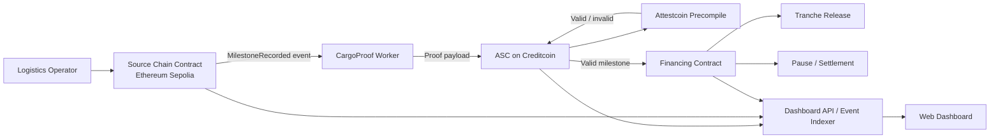

# CargoProof
## Product Requirements Document (PRD)

**Versi:** 1.0 — Draft Hackathon MVP  
**Tanggal:** 4 September 2026  
**Pemilik produk:** Tim CargoProof  
**Target deployment:** Creditcoin testnet dan Ethereum Sepolia  
**Track:** RWA / DeFi  
**Status:** Siap untuk breakdown engineering

---

## 1. Ringkasan Eksekutif

CargoProof adalah **credit rail berbasis milestone** untuk membiayai perdagangan fisik menggunakan event pengiriman yang dapat diverifikasi lintas blockchain. Platform ini memungkinkan lender membuat fasilitas pembiayaan untuk sebuah shipment, kemudian melepaskan dana secara bertahap ketika milestone logistik—seperti keberangkatan, tiba di hub, dan delivery—terbukti secara kriptografis.

Event shipment dicatat pada source chain, yaitu Ethereum Sepolia untuk MVP. Attestcoin Protocol memverifikasi event tersebut di Creditcoin melalui Attestcoin Smart Contract. Setelah proof valid, smart contract Creditcoin menjalankan aturan pembiayaan, seperti melepaskan tranche, menghentikan pencairan, atau menyelesaikan fasilitas.

CargoProof tidak mengklaim memverifikasi dunia fisik secara langsung. Sistem memverifikasi event yang telah dipublikasikan oleh pihak yang berwenang ke source-chain contract. Batas kepercayaan ini harus dijelaskan secara eksplisit dalam dokumentasi dan demo.

> **Nilai utama:** CargoProof mengubah bukti kemajuan shipment menjadi pemicu keuangan yang dapat diprogram, tanpa bergantung pada satu oracle terpusat untuk memindahkan data lintas chain.

---

## 2. Latar Belakang dan Konteks

Creditcoin berfokus pada infrastruktur kredit dan mendukung Attestcoin Protocol sebagai lapisan untuk membaca serta memverifikasi data dari blockchain lain. Attestcoin menggunakan infrastruktur attestation terdesentralisasi sehingga smart contract di Creditcoin dapat memproses data sumber lintas chain tanpa mengandalkan satu operator oracle.[1] Dokumentasi resmi menyatakan bahwa verifikasi dapat diselesaikan dalam sekitar satu block dan batch query dapat mencakup hingga sepuluh query dengan continuity proof yang sama.[2]

BUIDL CTC 2026 Fall mewajibkan integrasi Attestcoin yang berfungsi dan bermakna, deployment di testnet, dokumentasi teknis, repository GitHub, deck atau whitepaper, serta video demo.[3] Karena itu, produk harus menjadikan verifikasi lintas chain sebagai bagian dari business logic, bukan sebagai fitur tambahan.

---

## 3. Masalah yang Diselesaikan

### 3.1 Masalah pengguna

Perusahaan logistik dan supplier sering membutuhkan modal kerja sebelum barang sampai ke pembeli. Lender menghadapi risiko karena status shipment biasanya berasal dari dokumen, API perusahaan, atau laporan manual. Sumber tersebut dapat terlambat, tidak konsisten, atau sulit diaudit.

Masalah yang hendak diselesaikan CargoProof adalah sebagai berikut:

| Masalah | Dampak | Respons CargoProof |
|---|---|---|
| Status shipment sulit diverifikasi | Lender menunda pencairan atau mengenakan biaya risiko tinggi | Status dicatat sebagai event pada source chain dan diverifikasi di Creditcoin |
| Pembiayaan dicairkan sekaligus | Risiko meningkat jika shipment gagal di tengah perjalanan | Dana dibagi menjadi beberapa tranche berbasis milestone |
| Data logistik tersebar | Rekonsiliasi manual lambat dan mahal | Shipment memiliki lifecycle on-chain yang dapat diaudit |
| Bukti delivery dapat dipakai ulang | Risiko double financing atau double settlement | Event memiliki identifier unik dan replay protection |
| Kegagalan shipment tidak langsung menghentikan fasilitas | Eksposur lender terus bertambah | ASC dapat menghentikan tranche berikutnya berdasarkan status proof |

### 3.2 Pernyataan masalah

> **Lender membutuhkan cara untuk menghubungkan pembiayaan dengan bukti kemajuan shipment yang dapat diverifikasi, sedangkan supplier membutuhkan modal kerja yang dapat dicairkan lebih cepat dan lebih transparan.**

---

## 4. Tujuan Produk

### 4.1 Tujuan MVP

1. Memungkinkan lender membuat financing agreement untuk shipment tertentu.
2. Memungkinkan operator atau pihak berwenang mencatat milestone shipment pada Ethereum Sepolia.
3. Memungkinkan ASC di Creditcoin memverifikasi event source chain menggunakan Attestcoin Protocol.
4. Memungkinkan smart contract melepas tranche hanya setelah proof valid.
5. Memblokir pencairan ketika milestone tidak valid, belum tersedia, sudah diproses, atau fasilitas telah dihentikan.
6. Menyediakan UI yang memperlihatkan status shipment, status proof, histori tranche, dan link transaksi.

### 4.2 Bukan tujuan MVP

MVP tidak mencakup integrasi GPS nyata, integrasi sistem ERP/logistik perusahaan, underwriting kredit berbasis data eksternal, stablecoin mainnet, KYC/AML, dispute resolution legal, atau pembiayaan dengan uang sungguhan. Semua nilai token pada MVP adalah nilai simulasi di testnet.

---

## 5. Persona dan Pengguna Sasaran

| Persona | Kebutuhan | Tindakan utama di CargoProof |
|---|---|---|
| Lender | Mengurangi risiko pencairan sebelum shipment mencapai milestone | Membuat fasilitas, menyetujui tranche, menghentikan fasilitas |
| Supplier atau borrower | Mendapat modal kerja sesuai kemajuan shipment | Mendaftarkan shipment dan menerima tranche |
| Logistics attestor | Mencatat event shipment yang menjadi sumber bukti | Menerbitkan event milestone di source chain |
| Risk reviewer | Memeriksa alasan pencairan atau penghentian | Melihat proof, event, status fasilitas, dan histori transaksi |
| Juri hackathon | Memahami keunikan dan keberfungsian produk dalam waktu singkat | Menjalankan skenario demo end-to-end |

### 5.1 Pengguna awal yang diprioritaskan

Pengguna awal yang paling sesuai adalah lender atau platform trade-finance yang membiayai supplier kecil dengan shipment bernilai menengah. Produk tidak ditujukan terlebih dahulu kepada konsumen retail karena kompleksitas operasional dan regulasi lebih tinggi.

---

## 6. Proposisi Nilai

CargoProof memberikan tiga manfaat utama.

Pertama, lender dapat mengaitkan pencairan dengan bukti milestone, bukan hanya janji repayment. Kedua, supplier memperoleh jalur modal kerja bertahap tanpa menunggu rekonsiliasi manual untuk setiap milestone. Ketiga, Creditcoin mendapatkan use case yang menggabungkan credit infrastructure, RWA, dan cross-chain verification.

### 6.1 Diferensiasi

CargoProof bukan sekadar invoice-financing dashboard. Produk ini adalah **milestone-based financing infrastructure** untuk physical commerce. Invoice atau shipment hanya menjadi objek pembiayaan; nilai utama terletak pada aturan yang menghubungkan event lintas chain dengan tindakan keuangan di Creditcoin.

---

## 7. User Journey Utama

### 7.1 Membuat fasilitas pembiayaan

1. Lender membuka halaman **Create Financing**.
2. Lender memasukkan shipment ID, borrower address, total principal, jumlah tranche, dan batas waktu milestone.
3. Smart contract CargoProof di Creditcoin membuat financing agreement.
4. Sistem menampilkan status `ACTIVE` dan daftar milestone yang harus dipenuhi.

### 7.2 Mencatat milestone

1. Operator menghubungkan wallet source chain.
2. Operator memilih shipment dan milestone.
3. Source-chain contract memancarkan event `MilestoneRecorded`.
4. Worker CargoProof mendeteksi event dan menunggu block yang dapat diattestasi.
5. Worker menyiapkan data transaksi, Merkle proof, dan continuity proof.

### 7.3 Memverifikasi dan melepaskan tranche

1. Worker atau lender mengirim proof ke ASC di Creditcoin.
2. ASC memanggil Attestcoin precompile untuk memverifikasi event source chain.
3. ASC memeriksa shipment ID, milestone type, nonce, dan status fasilitas.
4. Jika seluruh pemeriksaan berhasil, fungsi `releaseTranche` dijalankan.
5. Borrower menerima tranche simulasi dan status berubah menjadi `RELEASED`.
6. UI menampilkan transaksi verifikasi, transaksi payout, dan alasan pencairan.

### 7.4 Menangani kegagalan

Jika proof tidak valid, event belum attested, event sudah diproses, atau deadline terlewati, tranche tidak dilepas. Sistem menyimpan alasan kegagalan dan mempertahankan status fasilitas sesuai aturan.

---

## 8. Ruang Lingkup Fitur MVP

### 8.1 Source-chain Shipment Registry

Contract pada Ethereum Sepolia harus menyediakan fungsi berikut:

| Fungsi | Deskripsi |
|---|---|
| `registerShipment` | Membuat shipment dengan ID unik dan metadata minimum |
| `recordMilestone` | Mencatat milestone yang disetujui operator |
| `getShipment` | Membaca status shipment |
| `getMilestone` | Membaca detail milestone |

Contract memancarkan event berikut:

- `ShipmentRegistered(shipmentId, borrower, lender, cargoHash)`
- `MilestoneRecorded(shipmentId, milestoneId, milestoneType, occurredAt, metadataHash)`
- `ShipmentDelivered(shipmentId, deliveredAt)`

`metadataHash` hanya menyimpan komitmen terhadap metadata. MVP tidak menyimpan dokumen privat secara on-chain.

### 8.2 Creditcoin Financing Contract

Contract di Creditcoin harus menyediakan fungsi berikut:

| Fungsi | Deskripsi |
|---|---|
| `createFacility` | Membuat fasilitas pembiayaan untuk shipment |
| `submitAttestedMilestone` | Memproses proof Attestcoin dan milestone yang diverifikasi |
| `releaseTranche` | Melepaskan tranche setelah semua validasi berhasil |
| `pauseFacility` | Menghentikan pencairan berikutnya |
| `settleFacility` | Menandai fasilitas selesai setelah delivery dan settlement |
| `getFacility` | Membaca status fasilitas dan parameter pembiayaan |
| `getTranche` | Membaca status tiap tranche |

Status fasilitas minimum:

`ACTIVE`, `PAUSED`, `DEFAULTED`, `SETTLED`, dan `CANCELLED`.

Status tranche minimum:

`PENDING`, `RELEASED`, `BLOCKED`, dan `SETTLED`.

### 8.3 Attestcoin Verification Adapter

Adapter harus mengisolasi detail pemanggilan Attestcoin dari business logic CargoProof. Adapter bertanggung jawab untuk:

1. Menerima referensi chain sumber, block height, encoded transaction, Merkle proof, dan continuity proof.
2. Memanggil native precompile Attestcoin sesuai dokumentasi jaringan.
3. Memastikan hasil verifikasi dikaitkan dengan event yang diharapkan.
4. Mengembalikan hasil verifikasi ke financing contract.
5. Mencegah pemrosesan ulang event yang sama.

Business logic tidak boleh memperlakukan input dari worker sebagai bukti valid sebelum hasil precompile berhasil.

### 8.4 Off-chain Worker

Worker memantau event source chain dan mengirimkan proof ke Creditcoin. Worker tidak memiliki kewenangan untuk melewati verifikasi atau memaksa pencairan.

Fungsi minimum worker:

- Event polling atau subscription.
- Deduplication berdasarkan transaction hash dan log index.
- Penantian block finality atau attestation readiness.
- Penyusunan payload proof.
- Retry dengan batas maksimum.
- Logging status `DETECTED`, `WAITING_FOR_ATTESTATION`, `SUBMITTED`, `VERIFIED`, atau `FAILED`.

### 8.5 Dashboard Web

Dashboard minimum terdiri atas empat tampilan:

| Tampilan | Isi utama |
|---|---|
| Overview | Total fasilitas, tranche pending, dan status shipment |
| Create Facility | Form pembuatan fasilitas oleh lender |
| Shipment Detail | Timeline milestone, proof status, dan metadata hash |
| Financing Detail | Principal, tranche, status, payout, dan failure reason |

UI harus membedakan dengan jelas antara:

- Event tercatat di source chain.
- Event telah attested.
- Proof telah diverifikasi di Creditcoin.
- Tranche telah dilepas.

---

## 9. Arsitektur Sistem

### 9.1 Trust boundary

| Komponen | Dipercaya untuk | Tidak dipercaya untuk |
|---|---|---|
| Source-chain operator | Menerbitkan event sesuai otoritasnya | Menentukan sendiri pencairan di Creditcoin |
| Worker | Memantau event dan mengirim proof | Membuat proof valid secara arbitrer |
| Attestcoin | Memverifikasi data transaksi dan proof lintas chain | Memastikan data fisik di luar chain benar |
| Financing contract | Menjalankan aturan tranche dan status | Menilai kualitas barang tanpa data tambahan |
| Frontend | Menampilkan status dan memulai transaksi | Menjadi sumber kebenaran finansial |

---

## 10. Model Data Minimum

### 10.1 Shipment

| Field | Tipe | Keterangan |
|---|---|---|
| `shipmentId` | `bytes32` | Identifier global shipment |
| `borrower` | `address` | Penerima pembiayaan |
| `lender` | `address` | Pemberi pembiayaan |
| `cargoHash` | `bytes32` | Hash metadata cargo |
| `sourceChainId` | `uint256` | Chain tempat event dicatat |
| `status` | `enum` | `REGISTERED`, `IN_TRANSIT`, `DELIVERED`, `FAILED` |
| `createdAt` | `uint256` | Waktu registrasi |

### 10.2 Milestone

| Field | Tipe | Keterangan |
|---|---|---|
| `milestoneId` | `bytes32` | Identifier unik milestone |
| `shipmentId` | `bytes32` | Relasi ke shipment |
| `milestoneType` | `uint8` | Departed, hub arrival, delivered |
| `sourceTxHash` | `bytes32` | Transaksi sumber |
| `sourceLogIndex` | `uint256` | Posisi event dalam transaksi |
| `occurredAt` | `uint256` | Waktu event |
| `metadataHash` | `bytes32` | Hash metadata tambahan |
| `processed` | `bool` | Replay protection |

### 10.3 Financing Facility

| Field | Tipe | Keterangan |
|---|---|---|
| `facilityId` | `bytes32` | Identifier fasilitas |
| `shipmentId` | `bytes32` | Shipment yang dibiayai |
| `principal` | `uint256` | Nilai pembiayaan simulasi |
| `releasedAmount` | `uint256` | Total yang telah dilepas |
| `trancheCount` | `uint8` | Jumlah tranche |
| `nextMilestone` | `uint8` | Milestone pemicu berikutnya |
| `deadline` | `uint256` | Batas waktu fasilitas |
| `status` | `enum` | Status fasilitas |

---

## 11. Aturan Bisnis

1. Satu `shipmentId` tidak boleh memiliki lebih dari satu fasilitas aktif pada MVP.
2. Total nilai seluruh tranche tidak boleh melebihi `principal`.
3. Tranche hanya dapat dilepas untuk milestone yang sesuai urutan.
4. Proof harus berasal dari source chain dan transaksi yang telah ditentukan pada facility.
5. Satu event milestone tidak dapat digunakan dua kali.
6. Fasilitas berstatus `PAUSED`, `DEFAULTED`, `SETTLED`, atau `CANCELLED` tidak dapat melepaskan tranche baru.
7. Delivery hanya dapat menyelesaikan fasilitas jika seluruh kondisi settlement terpenuhi.
8. Borrower tidak boleh mengubah lender, principal, atau milestone rule setelah facility aktif.
9. Lender dapat melakukan pause sebelum tranche berikutnya dilepas.
10. Semua perubahan status penting harus memancarkan event on-chain.
11. Metadata privat tidak boleh disimpan secara plaintext di blockchain.
12. MVP menggunakan token testnet dan tidak boleh dipasarkan sebagai layanan pembiayaan nyata.

---

## 12. Acceptance Criteria

### 12.1 Core flow

- Lender dapat membuat facility untuk shipment yang valid.
- Operator dapat mencatat minimal tiga milestone pada source chain.
- Worker dapat menemukan event dan menghasilkan payload proof.
- ASC dapat memanggil Attestcoin Protocol untuk memverifikasi proof.
- Financing contract melepaskan tranche yang tepat setelah proof valid.
- Dashboard menampilkan status source event, verification, dan payout.

### 12.2 Negative flow

- Proof yang diubah ditolak.
- Proof dari transaksi yang bukan event target ditolak.
- Event yang sama untuk kedua kalinya ditolak.
- Milestone yang tidak berurutan ditolak.
- Fasilitas yang paused tidak dapat mencairkan dana.
- Proof yang belum siap atau belum attested tidak menyebabkan payout.
- Tranche yang melebihi principal ditolak.

### 12.3 Quality and documentation

- Repository memiliki README yang dapat menjalankan deployment dari lingkungan bersih.
- README memiliki diagram arsitektur, alamat contract, network, dan contoh transaksi.
- Terdapat automated tests untuk happy path dan minimal lima negative cases.
- Terdapat video demo end-to-end berdurasi sekitar tiga sampai lima menit.
- Semua klaim tentang Attestcoin membedakan verifikasi event on-chain dari verifikasi kondisi dunia nyata.

---

## 13. Non-Functional Requirements

| Area | Requirement MVP |
|---|---|
| Keamanan | Replay protection, access control, checks-effects-interactions, dan validasi input |
| Transparansi | Semua milestone, proof result, payout, dan perubahan status dapat dilacak |
| Reliability | Worker memiliki retry dan tidak menggandakan submission |
| Performance | UI menampilkan status transaksi tanpa memerlukan refresh manual berulang |
| Privacy | Metadata privat direpresentasikan sebagai hash, bukan plaintext |
| Reproducibility | Deployment dan demo dapat diulang dengan script yang terdokumentasi |
| Usability | Juri dapat memahami state machine tanpa membaca source code terlebih dahulu |
| Auditability | Setiap payout memiliki referensi ke milestone dan source transaction |

---

## 14. Scope Prioritas

### P0 — Wajib untuk submission

- Source-chain registry.
- Creditcoin financing contract.
- Attestcoin proof verification.
- Worker sederhana.
- Payout tranche.
- Pause dan replay protection.
- Dashboard status.
- Testnet deployment.
- README, deck, dan demo video.

### P1 — Menambah daya saing

- Batch verification untuk beberapa query.
- Risk timeline.
- Expiry dan automatic default.
- Multi-signer operator authorization.
- Simulasi biaya dan estimasi waktu.
- Export proof receipt.

### P2 — Roadmap pascahackathon

- Integrasi ERP atau logistics API.
- Integrasi device identity dan IoT.
- Stablecoin settlement.
- Multiple lender marketplace.
- Credit scoring berdasarkan repayment history.
- Private metadata layer.
- Dispute resolution dan legal document integration.
- Deployment ke chain sumber tambahan.

---

## 15. Risiko dan Mitigasi

| Risiko | Dampak | Mitigasi |
|---|---|---|
| Integrasi Attestcoin membutuhkan detail proof yang sulit | Demo gagal | Mulai dari repository contoh resmi dan isolasi adapter verification |
| Attestation tidak siap tepat waktu | Worker tidak dapat mengirim proof | Tampilkan state `WAITING_FOR_ATTESTATION` dan siapkan pre-generated demo path untuk testnet |
| Data shipment palsu dari operator | Model trust tidak realistis | Dokumentasikan bahwa CargoProof memverifikasi event on-chain, lalu tambahkan multi-signer sebagai roadmap |
| UI terlihat seperti dashboard biasa | Nilai produk tidak tersampaikan | Tampilkan animasi atau timeline dari source event ke proof ke payout |
| Juri menganggapnya invoice financing generik | Novelty rendah | Tekankan milestone-based physical commerce dan conditional credit rail |
| Payout dapat dipanggil ulang | Risiko double release | Gunakan `processed` flag, nonce, dan invariant total payout <= principal |
| Testnet tidak stabil | Demo terganggu | Sediakan script reset, seeded scenario, transaction links, dan fallback recorded demo |
| Klaim terlalu luas tentang trustlessness | Kredibilitas turun | Jelaskan trust boundaries dan tanggung jawab operator secara eksplisit |

---

## 16. Strategi Demo Juri

Demo harus dimulai dengan masalah, bukan dengan kode.

### Urutan demo tiga sampai lima menit

1. Tampilkan lender dengan fasilitas senilai US$10.000 dan tiga tranche.
2. Tampilkan bahwa status awal shipment adalah `REGISTERED` dan tidak ada dana yang dilepas.
3. Catat event `CargoDeparted` di Ethereum Sepolia.
4. Tampilkan worker mendeteksi event dan menunggu attestation.
5. Kirim proof ke ASC di Creditcoin.
6. Tampilkan proof valid dan tranche pertama dilepas.
7. Catat event `CargoDelivered` atau `CargoArrivedAtHub` untuk tranche berikutnya.
8. Jalankan satu failure case dengan proof yang salah atau milestone yang tidak berurutan.
9. Tampilkan transaksi dan status `BLOCKED`.
10. Tutup dengan penjelasan bahwa Creditcoin menjalankan business logic setelah Attestcoin memverifikasi bukti lintas chain.

### Kalimat pembuka demo

> “Cargo financing should not depend on a PDF saying that cargo moved. CargoProof turns verifiable shipment milestones into programmable credit decisions.”

### Kalimat penutup demo

> “Attestcoin is not our decoration layer. It is the evidence layer that determines whether Creditcoin releases, pauses, or settles real-world financing logic.”

---

## 17. Metrik Keberhasilan

### 17.1 Metrik hackathon

| Metrik | Target |
|---|---:|
| Source-chain milestone events yang berhasil diverifikasi | Minimal 3 |
| Tranche release berdasarkan proof valid | Minimal 2 |
| Negative cases yang berhasil diblokir | Minimal 5 |
| Waktu demo dari event ke verification result | Terlihat dalam satu sesi demo |
| Test coverage untuk core contracts | Minimal 80% untuk business logic |
| Waktu setup dari repository bersih | Maksimal 15 menit dengan README |

### 17.2 Metrik pascahackathon

| Metrik | Target awal |
|---|---:|
| Lender pilot | 1–2 |
| Shipment pilot | 10+ |
| Nilai pembiayaan simulasi atau pilot | US$50.000+ |
| Persentase milestone yang dapat diproses otomatis | 90%+ |
| Waktu rekonsiliasi dibanding proses manual | Berkurang minimal 50% |

---

## 18. Model Bisnis Awal

CargoProof dapat menghasilkan pendapatan melalui biaya penggunaan infrastruktur, bukan melalui spread pinjaman pada tahap awal. Model yang disarankan adalah:

1. Biaya per financing facility.
2. Biaya per verified milestone.
3. Biaya SaaS untuk dashboard lender dan operator.
4. Biaya integrasi untuk perusahaan logistik.
5. Revenue share dengan platform trade-finance.

Model ini menjaga CargoProof tetap sebagai penyedia infrastruktur dan mengurangi kebutuhan untuk menjadi lender berlisensi pada tahap awal. Legal review tetap diperlukan sebelum deployment produksi.

---

## 19. Roadmap

### Fase 1 — Hackathon MVP

Targetnya adalah satu source chain, satu financing contract, tiga milestone, worker sederhana, dashboard, dan demo failure case.

### Fase 2 — Pilot terkontrol

Targetnya adalah integrasi satu operator logistik atau supplier, penggunaan stablecoin testnet atau sandbox, multi-signer authorization, dan monitoring operasional.

### Fase 3 — Production readiness

Targetnya adalah security review, audit contract, privacy design, KYC/AML assessment, legal structure, data-provider integrations, dan deployment dengan partner lender.

### Fase 4 — Credit network

Targetnya adalah marketplace lender, reputation dari histori repayment, cross-chain financing untuk berbagai source chain, serta standardized shipment attestation schema.

---

## 20. Keputusan Produk yang Harus Dikunci

Sebelum engineering dimulai, tim harus mengunci keputusan berikut:

| Keputusan | Rekomendasi MVP |
|---|---|
| Source chain | Ethereum Sepolia |
| Settlement chain | Creditcoin testnet |
| Asset pembayaran | Token testnet |
| Jumlah milestone | Tiga: departed, hub arrival, delivered |
| Jumlah tranche | Tiga, satu per milestone |
| Pemicu proof | `MilestoneRecorded` event |
| Sumber metadata | Hash metadata, tanpa plaintext privat |
| Operator authorization | Satu authorized operator untuk MVP; multi-signer P1 |
| Worker mode | Polling sederhana dengan retry |
| Financing model | Satu lender dan satu borrower per facility |
| Target demo | Satu happy path dan satu failure path |

---

## 21. Checklist Submission Hackathon

- [ ] Nama proyek: CargoProof.
- [ ] Track: RWA atau DeFi.
- [ ] Deskripsi produk maksimal dan mudah dipahami.
- [ ] Ringkasan integrasi Attestcoin.
- [ ] GitHub repository publik dengan README.
- [ ] Contract source code dan test.
- [ ] Source-chain deployment.
- [ ] Creditcoin deployment.
- [ ] Alamat contract dan network terdokumentasi.
- [ ] Deck atau whitepaper dalam format PDF.
- [ ] Video demo prototipe.
- [ ] Bukti happy path.
- [ ] Bukti failure path.
- [ ] Penjelasan trust boundary.
- [ ] Penjelasan roadmap dan potensi CEIP.
- [ ] Profil seluruh anggota tim.

---

## 22. Rekomendasi Keputusan

CargoProof layak dikembangkan sebagai submission utama apabila tim dapat membuat proof flow berjalan secara nyata di testnet. Fokus engineering harus berada pada tiga hal: **validasi proof, state machine financing, dan demo yang dapat diulang**. UI yang mewah tidak dapat menggantikan integrasi Attestcoin yang gagal.

Urutan implementasi paling aman adalah menggunakan contoh resmi Attestcoin untuk memastikan alur proof dasar, kemudian mengganti business logic contoh loan dengan shipment milestone dan tranche financing. Setelah alur inti stabil, tambahkan dashboard dan narrative product.

Target kualitas submission adalah skor simulasi minimal **86/100**. Untuk mencapai kandidat top 3, tim harus menunjukkan bahwa event valid menghasilkan payout, event invalid diblokir, event lama tidak dapat dipakai ulang, serta seluruh proses dapat dipahami juri tanpa penjelasan panjang.

---

## References

[1]: https://creditcoin.org/ "Creditcoin — Cross-Chain dApp Building"

[2]: https://docs.attestcoin.org/attestcoin-protocol.md "Attestcoin Protocol Documentation"

[3]: https://dorahacks.io/hackathon/buidl-ctc-2026-fall/detail "BUIDL CTC 2026 Fall — Official Hackathon Details"

[4]: https://github.com/gluwa/attestcoin-protocol-examples "Attestcoin Protocol Examples — GitHub Repository"

[5]: https://docs.attestcoin.org/attestcoin-protocol/guided-tutorials "Attestcoin Protocol Guided Tutorials"

---

**Author:** Manus AI  
**Dokumen:** CargoProof Product Requirements Document
